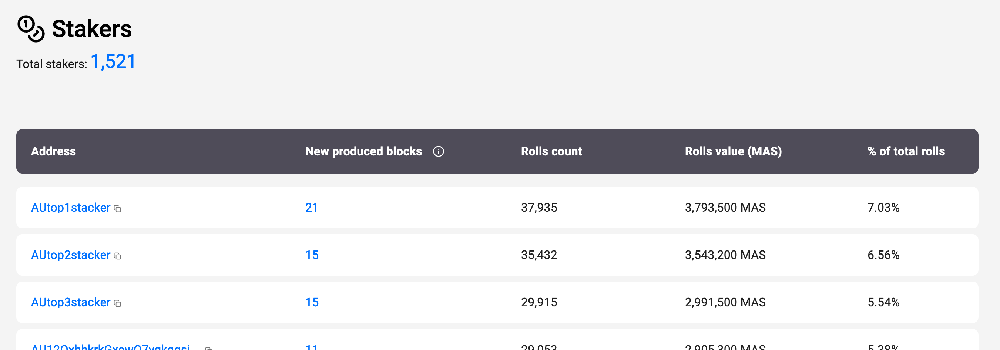

# MasRevealExplorer

**Reveal MAS addresses in the explore to easy-to-read name.**

screenshot: 

## Tech

Made by following this tutorial:
https://developer.mozilla.org/en-US/docs/Mozilla/Add-ons/WebExtensions/Your_first_WebExtension